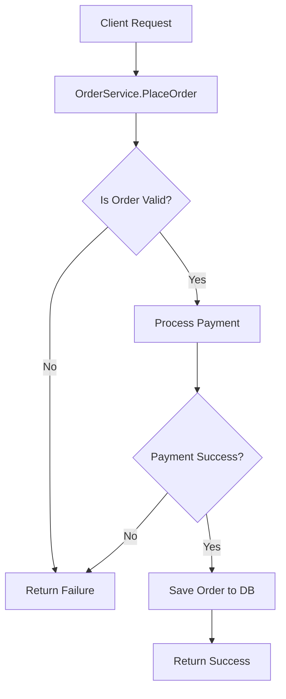

[Back to 目录（Index）](https://github.com/uwspstar/The-Tao-of-Programming-Nature/blob/main/Index.md)

## Chapter 1: The Dao of Code

## 第一章：代码之道

---

### 🌀 1. What is “Dao” in Programming?

### 什么是编程中的“道”？

> The Dao is the underlying principle of all things.
> 道，是万物之本源。

> In programming, Dao means the invisible logic that governs good software.
> 在编程中，道，是掌管好软件之隐性逻辑。

> It is not the framework, not the language, but the way of thinking.
> 它不是框架，不是语言，而是一种思维方式。

---

### 🧠 2. Why Seek the Dao?

### 为什么要寻找“道”？

> Without Dao, code becomes chaotic.
> 无道，则代码混乱。

> Bugs multiply. Features bloat. Deadlines crush.
> Bug繁衍，功能臃肿，期限压顶。

> With Dao, clarity emerges. Systems evolve naturally.
> 有道，则清晰浮现，系统自然演化。

---

### 🕰️ 3. When to Follow the Dao?

### 什么时候该遵循“道”？

> Always. Especially when you’re lost in code.
> 时刻皆是，尤其在你迷失于代码之时。

> Dao is clearest when chaos arises.
> 当混乱来临，道之本质才显现。

---

### 🗺️ 4. Where Does the Dao Apply?

### “道”适用于何处？

> In every layer: backend logic, UI flow, database schema.
> 道贯穿每一层：后端逻辑、界面流程、数据库结构。

> Even in naming variables — Dao lives in the details.
> 甚至在命名变量之中，道藏于细微。

---

### ⚙️ 5. How to Practice the Dao of Code?

### 如何践行“代码之道”？

> 🧭 **By writing less but saying more.**
> 以少写达多义。

> 🔁 **By letting code reveal itself, not forcing it.**
> 让代码自然呈现，而非强行捏造。

> 🌿 **By flowing with design, not against it.**
> 顺势而为，而非逆势造作。

---

### 💻 C# 示例代码：以“道”而写的服务模式

```csharp
public interface IOrderService
{
    Result PlaceOrder(Order order);
}

public class OrderService : IOrderService
{
    private readonly IPaymentProcessor _payment;
    private readonly IOrderRepository _repository;

    public OrderService(IPaymentProcessor payment, IOrderRepository repository)
    {
        _payment = payment;
        _repository = repository;
    }

    public Result PlaceOrder(Order order)
    {
        if (!order.IsValid())
            return Result.Failure("Invalid order");

        var paymentResult = _payment.Process(order);
        if (!paymentResult.IsSuccess)
            return Result.Failure("Payment failed");

        _repository.Save(order);
        return Result.Success("Order placed");
    }
}
```

> 🧘 这是“道式代码”：依赖分明、职责单一、拒绝混乱。
> This is Dao-style code: clear dependency, single responsibility, no chaos.

---

### 🧩 Mermaid Diagram：服务调用流程图



> 🧭 一图胜万言，流程即是“道”的体现。
> A diagram speaks a thousand lines — flow is Dao in motion.

---

### Claude 风格结语格言

> 🌌 The best code flows like water — shapeless, formless, yet powerful.
> 最佳的代码如水流，无形无状，却无所不在。

> ☯ In the Dao of Code, clarity is strength, and elegance is power.
> 在代码之道中，清晰即力量，优雅即力量。
