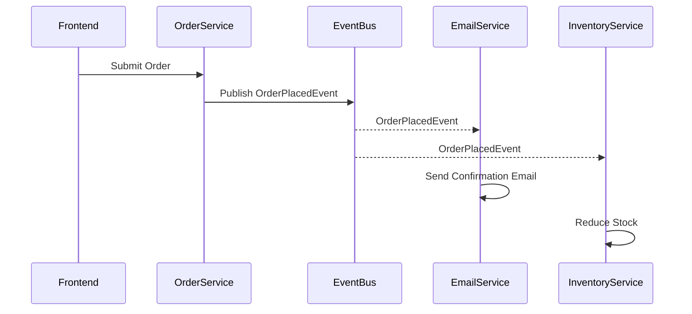

## 📘 Chapter 7: Event-Driven as Natural Reaction

## 第七章：事件驱动之自然反应

---

### 🌀 1. What is Event-Driven Architecture?

### 什么是“事件驱动架构”？

> It is an architecture where actions respond to events, not commands.
> 它是一种对事件作出反应，而非接受命令的架构。

> Like nature — where thunder follows lightning, and water flows when rain falls.
> 如同自然——雷随电而鸣，雨落水自流。

> Events are signals; reactions are autonomous.
> 事件是信号，反应是自发。

---

### 🧠 2. Why Use Event-Driven Systems?

### 为什么要采用事件驱动系统？

> Because coupling kills scalability.
> 紧耦合扼杀扩展性。

> Event-driven systems are flexible, decoupled, and reactive.
> 事件驱动架构灵活、解耦、具备响应性。

> Systems evolve — your architecture must adapt.
> 系统会演化，架构也必须顺应。

---

### 🕰️ 3. When is Event-Driven Ideal?

### 什么时候适合使用事件驱动？

> When business logic spans multiple domains.
> 当业务逻辑跨越多个领域时。

> When async workflows are natural.
> 当异步流程顺理成章时。

> When you want audit trails and loose coupling.
> 当你需要审计轨迹与松耦合时。

---

### 🗺️ 4. Where Do Events Flow?

### 事件如何流动？

> From UI clicks to domain reactions.
> 从界面点击流向领域反应。

> From service to service, as a pulse through your system.
> 从服务到服务，如脉搏贯穿系统。

> From one aggregate to another, without direct dependencies.
> 从一个聚合流向另一个，无需直接依赖。

---

### ⚙️ 5. How to Design with Event-Driven Thinking?

### 如何以事件驱动的思维设计系统？

> 🧭 **Start with the events, not the handlers.**
> 从事件出发，而非从处理器开始。

> 🧘 **Think: “What just happened?”, not “What do I need to do?”**
> 思考“发生了什么”，而不是“我要做什么”。

> 📡 **Publish facts, not commands.**
> 发布“事实”，而非“命令”。

---

### 💻 C# 示例代码：发布订单事件的服务

```csharp
public class OrderService
{
    private readonly IEventBus _bus;

    public OrderService(IEventBus bus)
    {
        _bus = bus;
    }

    public void PlaceOrder(Order order)
    {
        // 保存订单逻辑省略...

        // 发布事件，不直接调用其他服务
        _bus.Publish(new OrderPlacedEvent(order.Id, order.CustomerName));
    }
}

public record OrderPlacedEvent(string OrderId, string CustomerName);
```

> 📢 “我下单了”是一种声明，而不是请求发货。
> "OrderPlaced" is a fact, not a request — let listeners decide what to do.

---

### 🧩 Mermaid 图：事件驱动流程图



> ☯ 每个组件不再被控制，它们只是自然地响应世界的变化。
> Each component no longer obeys — it responds naturally to change.

---

### 🧙‍♂️ Claude 风格结语格言

> 🌩️ An event is not a command. It is thunder that echoes a lightning truth.
> 事件不是命令，它是雷鸣，回响于闪电之后的事实。

> 🌱 Systems that react flow like nature —
> ever-changing, yet deeply harmonious.
> 响应式系统如同自然——千变万化，终归和谐。
