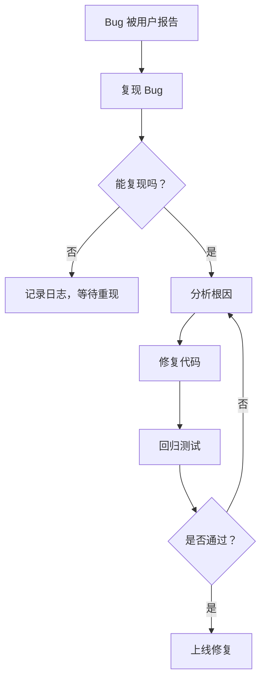

## 📘 Chapter 3: Harmony with Bugs

## 第三章：与 Bug 共处

---

### 🌀 1. What Are Bugs, Really?

### Bug 究竟是什么？

> Bugs are not enemies. They are misunderstood feedback.
> Bug 不是敌人，而是被误解的反馈。

> They reveal where your understanding and the system diverge.
> 它们暴露你与系统理解的分歧。

> A bug is a teacher — if you choose to learn.
> Bug 是老师，只要你愿意学习。

---

### 🧠 2. Why Make Peace with Bugs?

### 为什么要与 Bug 和平共处？

> Fighting bugs causes stress. Understanding them brings growth.
> 与 Bug 斗争令人焦虑，理解 Bug 使人成长。

> Bugs show you where your assumptions failed.
> Bug 揭示你假设的破裂点。

> The better you listen to a bug, the less it returns.
> 你越能听懂一个 Bug，它就越少回来。

---

### 🕰️ 3. When Do Bugs Appear?

### Bug 何时出现？

> When complexity exceeds clarity.
> 当复杂性超过清晰度时。

> When systems grow faster than understanding.
> 当系统膨胀快于认知成长时。

> When tests are weak, or assumptions are strong.
> 当测试弱，而假设强时，Bug 自然而生。

---

### 🗺️ 4. Where Are Bugs Hidden?

### Bug 潜藏在哪里？

> In silent nulls.
> 在沉默的 null 中。

> In forgotten edge cases.
> 在被遗忘的边界条件中。

> In the mind of the last developer who "just made it work".
> 在“能跑就行”的前任脑海中。

---

### ⚙️ 5. How to Live with Bugs in Harmony?

### 如何与 Bug 和谐共处？

> 🧭 **Don’t panic. Observe.**
> 不要恐慌，先观察。

> 🔍 **Reproduce with curiosity, not frustration.**
> 带着好奇复现，而非带着怒气。

> 🧠 **Fix the cause, not just the symptom.**
> 修根因，而非头痛医头。

---

### 💻 C# 示例代码：从 Bug 到觉悟的过程

```csharp
public class UserService
{
    public string GetDisplayName(User user)
    {
        // 初版 Bug：如果 user 或 user.Name 为 null，将抛异常
        return user.Name.Trim(); 
    }
}

// 修复后 —— 以理解为基础的改进
public class UserServiceV2
{
    public string GetDisplayName(User user)
    {
        if (user?.Name == null)
            return "Anonymous";

        return user.Name.Trim();
    }
}
```

> 🌱 代码修复的本质，不只是让程序继续运行，而是让心智更清晰。
> Fixing a bug means more than restoring flow — it means restoring clarity.

---

### 🧩 Mermaid 图：发现与修复 Bug 的心路历程



> 🐛 每一个 Bug，都是一次认知的修炼旅程。
> Every bug is a journey of cognitive refinement.

---

### 🧙‍♂️ Claude 风格结语格言

> 🪞 The bug you fear most often reveals the truth you avoid.
> 最怕的 Bug，往往揭示你最回避的真相。

> ☯ Bugs are not flaws in your system,
> but mirrors to your design soul.
> Bug 不是系统的缺陷，而是设计灵魂的镜子。
