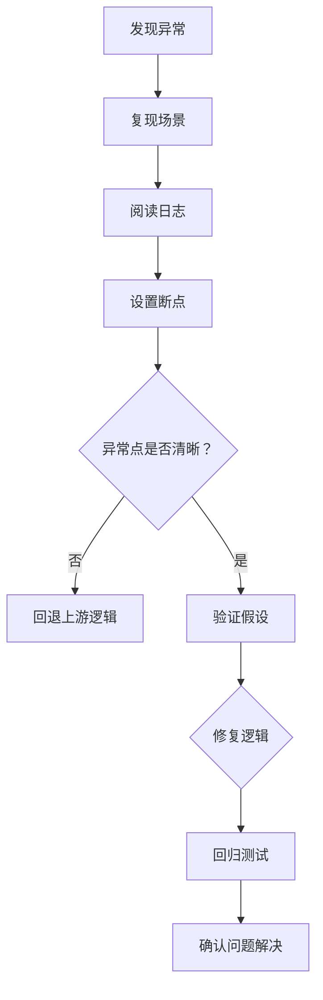

[Back to 目录（Index）](https://github.com/uwspstar/The-Tao-of-Programming-Nature/blob/main/Index.md)

## 📘 Chapter 9: The Inner Peace of Debugging

## 第九章：调试中的内心平静

---

### 🌀 1. What is Debugging?

### 什么是调试？

> Debugging is not war — it is meditation.
> 调试不是战争，而是冥想。

> It is the art of listening to your system.
> 它是一种倾听系统的艺术。

> The bug is not your enemy — it’s your misunderstood self.
> Bug 不是敌人，而是你误解的自己。

---

### 🧠 2. Why Seek Inner Peace When Debugging?

### 为什么调试时需要内心平静？

> Because panic clouds perception.
> 恐慌会蒙蔽认知。

> Because rushing often hides the root cause.
> 匆忙常常掩盖根因。

> Debugging is a dialogue — not a diagnosis.
> 调试是对话，不是审判。

---

### 🕰️ 3. When Does Calm Matter Most?

### 什么时候平静最为重要？

> When the bug is elusive.
> 当 Bug 难以重现时。

> When logs lie, and assumptions fail.
> 当日志误导，假设崩塌时。

> When pressure mounts — peace clears your mind.
> 当压力激增，平静才能让你看清真相。

---

### 🗺️ 4. Where Does Debugging Begin?

### 调试从哪里开始？

> From the symptoms — but not with assumptions.
> 从现象开始，但不能带着假设。

> In logs, traces, breakpoints, and patterns.
> 于日志、追踪、断点、模式之中。

> In your own logic — your own mind.
> 在你的逻辑，也在你的内心。

---

### ⚙️ 5. How to Debug with Peace?

### 如何带着平静去调试？

> 🔍 **Reproduce the issue without emotion.**
> 冷静复现问题，不掺杂情绪。

> 🧭 **Step back before you step through.**
> 下断点前，先理清流程。

> 🧘 **Let the system speak. Follow the clues.**
> 让系统说话，顺着线索而行。

---

### 💻 C# 示例代码：调试流程中的理性分析

```csharp
public class PaymentProcessor
{
    public Result Charge(Card card, decimal amount)
    {
        if (card == null)
            return Result.Failure("Card is null");

        if (amount <= 0)
            return Result.Failure("Amount must be positive");

        // ⚠️ Bug: forgot to check card validity date
        return Result.Success("Charged");
    }
}
```

> 🔎 冷静分析：这段代码逻辑中缺乏边界校验 —— 调试的关键不在于改错，而在于看清流程。
> The key is not the fix, but the path that revealed the flaw.

---

### 🧩 Mermaid 图：调试过程中的思维之流



> 🧠 调试是一条从混沌走向理解的路径，关键是：**保持觉察，不要预设。**
> Debugging is the way from chaos to clarity — awareness over assumption.

---

### 🧙‍♂️ Claude 风格结语格言

> 🧘 You do not fix bugs by force.
> 你无法用蛮力解决 Bug。

> 🌌 You fix bugs by seeing clearly.
> 你靠清晰的洞察解决问题。

> 🔦 A calm mind reveals invisible paths.
> 平静的心，照见无形之线索。
