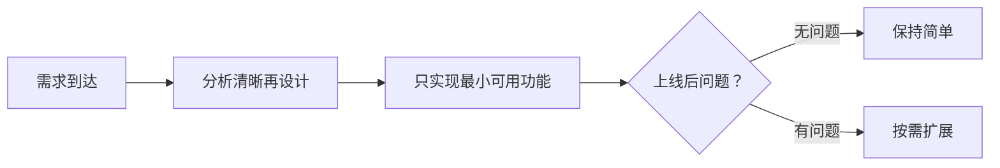

## 📘 Chapter 2: Wu Wei Coding

## 第二章：无为而编

---

### 🌀 1. What is “Wu Wei” in Coding?

### 什么是编程中的“无为”？

> Wu Wei is the principle of non-action — not doing nothing, but doing effortlessly.
> 无为，不是无所作为，而是无执着之作为。

> In code, Wu Wei is about writing only what is necessary.
> 在代码中，无为是指仅写必要之物。

> No overengineering. No ego-driven abstraction.
> 不过度设计，不为炫技而抽象。

---

### 🧠 2. Why Code with Wu Wei?

### 为什么要“无为而编”？

> Because most complexity is self-imposed.
> 因为大多数复杂，都是人为加之。

> Wu Wei leads to readable, maintainable, and elegant systems.
> 无为之道，带来可读、可维护、优雅之系统。

> It avoids “cleverness” that future you will curse.
> 它避免你未来骂自己的“聪明”。

---

### 🕰️ 3. When to Apply Wu Wei?

### 什么时候该应用“无为”？

> When tempted to write code “just in case”.
> 当你想写“以防万一”的代码时。

> When a requirement seems vague — wait, clarify, then act.
> 当需求模糊时——等待、澄清，再动手。

> When others rush, pause. In calm, the Dao is clearer.
> 众人急躁时，你静。静中，道更显。

---

### 🗺️ 4. Where Does Wu Wei Help Most?

### “无为”在哪些地方最有用？

> In API design, service layers, and infrastructure decisions.
> 在 API 设计、服务分层、基础架构决策中。

> In meetings, Wu Wei is listening more than talking.
> 在会议中，无为是多听少说。

> In debugging, it is letting logs and flow reveal the truth.
> 在调试中，无为是让日志与流程说话。

---

### ⚙️ 5. How to Practice Wu Wei in Code?

### 如何在代码中实践“无为”？

> 🧘 **By resisting the urge to be clever.**
> 抑制“炫技”冲动。

> 🧹 **By deleting before adding.**
> 添加前，先删冗余。

> ⛩️ **By embracing defaults and simple flows.**
> 拥抱默认值与简单流程。

---

### 💻 C# 示例代码：无为之 Web API 设计

```csharp
// 简洁的控制器层 —— 无为之道
[ApiController]
[Route("api/orders")]
public class OrdersController : ControllerBase
{
    private readonly IOrderService _service;

    public OrdersController(IOrderService service)
    {
        _service = service;
    }

    [HttpPost]
    public IActionResult Place(Order order)
    {
        var result = _service.PlaceOrder(order);
        return result.IsSuccess
            ? Ok(result.Message)
            : BadRequest(result.Message);
    }
}
```

> ✨ “少即是多”：仅暴露必要接口，不提前处理未到来的复杂逻辑。
> “Less is more”: expose only what is needed, avoid premature concerns.

---

### 🧩 Mermaid 图：系统中“无为”式设计流程



> 🪶 不预设问题、不构造问题，响应变化即是“道”。
> Do not assume problems, respond to them — that is Dao.

---

### 🧙‍♂️ Claude 风格结语格言

> ☁️ True mastery is not shown in what you build,
> but in what you choose not to build.
> 真正的高手，不在于能造什么，而在于不造什么。

> 🍃 The best code is like the wind: it leaves no trace, but moves all things.
> 最佳的代码如风：无痕，却驱动万物。
