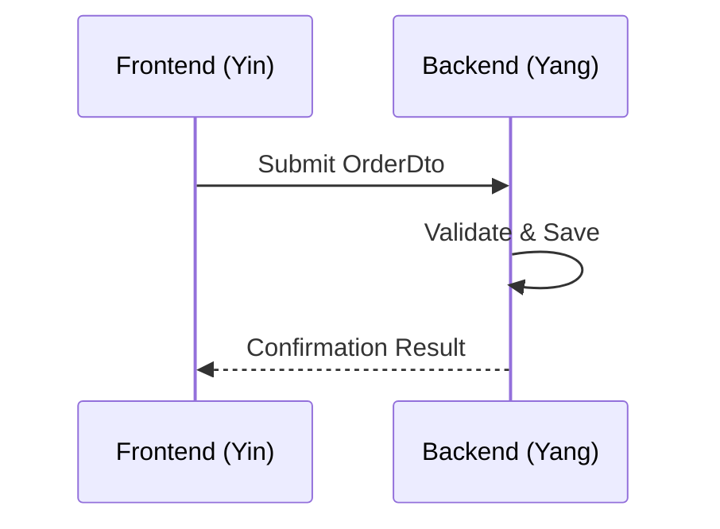

[Back to 目录（Index）](https://github.com/uwspstar/The-Tao-of-Programming-Nature/blob/main/Index.md)

## 📘 Chapter 5: Yin & Yang of Frontend and Backend

## 第五章：前后端的阴阳之道

---

### 🌀 1. What is the Yin-Yang of Software Architecture?

### 什么是软件架构中的“阴阳”？

> Yin is the passive, receptive — the frontend.
> 阴者，静而受 —— 前端为阴。

> Yang is the active, directive — the backend.
> 阳者，动而行 —— 后端为阳。

> Together they form a whole: UI and logic, appearance and essence.
> 阴阳相生，方成一体：界面与逻辑，表象与本质。

---

### 🧠 2. Why Treat Frontend and Backend as Yin-Yang?

### 为什么要将前后端视为阴阳？

> Because imbalance causes friction.
> 阴阳失衡，系统生涩。

> A strong backend with poor UX confuses users.
> 后端再强，若用户体验糟糕，皆为空谈。

> A fancy frontend without logic is a paper tiger.
> 前端再炫，若无逻辑支撑，形同虚设。

---

### 🕰️ 3. When Do Imbalances Show?

### 什么时候会出现阴阳失衡？

> When UI is designed without backend feasibility.
> 当 UI 脱离后端现实时。

> When backend APIs ignore UI’s flow.
> 当 API 不顾界面流程时。

> When teams fail to communicate — Yin and Yang drift apart.
> 团队失沟通，阴阳则分。

---

### 🗺️ 4. Where Should Yin-Yang Be Unified?

### 应在何处统一“阴阳”？

> In API contracts.
> 在 API 契约中。

> In domain-driven design shared across both ends.
> 在共享的领域模型中。

> In mutual empathy — backend knows UI needs, UI understands logic.
> 在共情中 —— 后端理解交互，前端尊重逻辑。

---

### ⚙️ 5. How to Harmonize Frontend and Backend?

### 如何调和前后端？

> 📐 **Design UI flows and API shapes together.**
> 联合设计界面流程与 API 结构。

> 🧭 **Use OpenAPI, Swagger, shared types.**
> 使用 OpenAPI、Swagger、共享数据模型。

> 🧘 **Have regular syncs — talk, not assume.**
> 定期同步 —— 说出来，而非猜出来。

---

### 💻 C# 示例代码：统一的前后端契约模型（DTO）

```csharp
// 共享的订单数据模型（DTO）—— 前后端一致
public class OrderDto
{
    public string Id { get; set; }
    public string ProductName { get; set; }
    public int Quantity { get; set; }
    public string Status { get; set; }
}
```

```typescript
// 前端 TypeScript 接口定义（共享模型）
export interface OrderDto {
    id: string;
    productName: string;
    quantity: number;
    status: string;
}
```

> 🔗 模型一致，前后端如气脉贯通；脱节即堵塞，贯通即顺畅。
> Shared models are shared Qi — where flow is smooth, bugs cannot dwell.

---

### 🧩 Mermaid 图：前后端合作之道



> ☯ 一送一收，一静一动，流程即为“道”。
> One sends, one responds — the movement is Dao.

---

### 🧙‍♂️ Claude 风格结语格言

> ☯ True architecture does not separate Yin and Yang.
> 真正的架构，不分阴阳。

> 🌐 It flows like Tai Chi —
> where backend moves with power, frontend yields with grace.
> 它如太极之流 —— 后端动如雷霆，前端静若止水。
