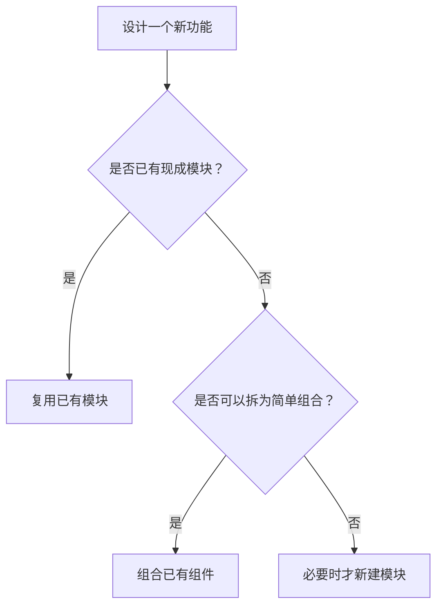

## 📘 Chapter 8: Do Less, Achieve More

## 第八章：少即是多

---

### 🌀 1. What Does "Do Less" Mean in Programming?

### 编程中的“少即是多”是什么意思？

> It means writing only what is necessary — and nothing more.
> 它意味着只写必要之物，除此皆省。

> It means optimizing for clarity, not cleverness.
> 优化的是清晰，不是炫技。

> It means letting the system breathe.
> 它是让系统有呼吸的空间。

---

### 🧠 2. Why Do Less?

### 为什么要“做得更少”？

> Because every line of code has a cost.
> 因为每一行代码都是负担。

> Code is easier to write than to maintain.
> 写代码容易，维护代码难。

> Doing less avoids traps of overengineering.
> 少做，避开“过度设计”的陷阱。

---

### 🕰️ 3. When is Less Truly More?

### 什么时候“少”才是真正的“多”？

> When designing features.
> 在设计功能时。

> When choosing libraries or tools.
> 在选择库和工具时。

> When you’re tempted to predict the future.
> 当你想预测未来时，别做太多。

---

### 🗺️ 4. Where Should You Apply the Principle of Less?

### 在哪些地方应实践“少即是多”？

> In class responsibilities.
> 在类的职责划分上。

> In API endpoints.
> 在 API 接口设计中。

> In UI/UX — fewer buttons, more meaning.
> 在界面设计中——按钮越少，意义越多。

---

### ⚙️ 5. How to Practice “Do Less” in Code?

### 如何在代码中实践“做得更少”？

> 🧹 **Remove unused abstractions.**
> 移除无用的抽象。

> 📦 **Use what's already available.**
> 重用已有工具与框架。

> 🪶 **Let the code speak for itself.**
> 让代码自述其意，不加干扰。

---

### 💻 C# 示例代码：精简控制器逻辑

```csharp
// 不必要的抽象与复杂性
public class OrderController : ControllerBase
{
    private readonly IServiceLocator _locator;

    public OrderController(IServiceLocator locator)
    {
        _locator = locator;
    }

    public IActionResult Submit(Order o)
    {
        var handler = _locator.Resolve<IOrderHandler>();
        return handler.Handle(o);
    }
}
```

```csharp
// 精简后的版本 —— 无中间跳转
public class OrderController : ControllerBase
{
    private readonly IOrderHandler _handler;

    public OrderController(IOrderHandler handler)
    {
        _handler = handler;
    }

    public IActionResult Submit(Order o) => _handler.Handle(o);
}
```

> ✂️ 每少一行冗余，维护者就少一分困扰。
> Each removed line saves a future headache.

---

### 🧩 Mermaid 图：选择“少做”的设计分岔流程



> 🧘‍♂️ 每一分不写的代码，都是对系统的善待。
> Every piece of code not written is kindness to the system.

---

### 🧙‍♂️ Claude 风格结语格言

> 🌿 Simplicity is not the absence of complexity,
> but the choice to embrace clarity.
> 简单，不是没有复杂，而是选择清晰。

> 🧩 The less you write, the more the system reveals its own truth.
> 写得越少，系统越能显现其本质之道。
