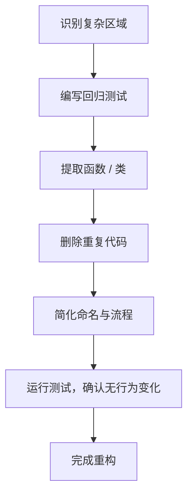

## 📘 Chapter 6: Refactoring as Return to Simplicity

## 第六章：重构即返璞归真

---

### 🌀 1. What is Refactoring?

### 什么是“重构”？

> Refactoring is not rewriting.
> 重构不是重写。

> It is restoring clarity without changing behavior.
> 它是在不改变行为的前提下，重拾清晰。

> It is code detox — returning to the natural state.
> 它是代码排毒 —— 让代码回归自然本源。

---

### 🧠 2. Why Refactor?

### 为什么要重构？

> Because code decays.
> 因为代码会腐朽。

> Features layer up, logic twists, clarity fades.
> 功能堆叠，逻辑扭曲，清晰消散。

> Refactoring is like pruning a bonsai — remove excess to reveal essence.
> 重构如修枝剪叶——去繁留简，还原本质。

---

### 🕰️ 3. When to Refactor?

### 什么时候该重构？

> Before adding new features.
> 在加新功能之前。

> When a bug keeps recurring.
> 当 Bug 反复出现。

> When developers begin to “fear” the module.
> 当团队开始“害怕”某模块时，就是时候了。

---

### 🗺️ 4. Where Does Refactoring Help Most?

### 重构在哪些地方最有价值？

> In God classes.
> 在“上帝类”中。

> In long methods with nested `if`s.
> 在嵌套层层的长函数中。

> In duplicated logic across services.
> 在服务之间复制黏贴的逻辑中。

---

### ⚙️ 5. How to Refactor with Simplicity in Mind?

### 如何以“返璞归真”的理念进行重构？

> 🔍 **Start by reading, not coding.**
> 先读代码，不急着动手。

> 🧘 **Extract till each unit has one purpose.**
> 提取逻辑至单一职责清晰。

> 🧭 **Use tests as compass — simplify without fear.**
> 以测试为指南，重构无所畏。

---

### 💻 C# 示例代码：重构前后对比

```csharp
// 重构前：冗长的订单验证逻辑
public bool Validate(Order order)
{
    if (order.Quantity <= 0) return false;
    if (string.IsNullOrEmpty(order.CustomerName)) return false;
    if (order.Product == null || order.Product.Stock < order.Quantity) return false;
    return true;
}
```

```csharp
// 重构后：拆解为可读性强的私有方法
public bool Validate(Order order)
{
    return HasValidQuantity(order) &&
           HasCustomerName(order) &&
           HasSufficientStock(order);
}

private bool HasValidQuantity(Order o) => o.Quantity > 0;
private bool HasCustomerName(Order o) => !string.IsNullOrEmpty(o.CustomerName);
private bool HasSufficientStock(Order o) => o.Product?.Stock >= o.Quantity;
```

> 🧼 重构是为了让未来的你感恩现在的你。
> Refactoring is a gift from today’s you to tomorrow’s you.

---

### 🧩 Mermaid 图：返璞归真式重构路径



> 🌱 重构的过程不是添加，而是剥离。
> Refactoring is not addition — it is revelation through removal.

---

### 🧙‍♂️ Claude 风格结语格言

> ✂️ True refinement lies not in adding brilliance,
> but in removing noise.
> 真正的精炼，不在于增辉，而在于除杂。

> 🧘‍♂️ To refactor is to return —
> to the code you meant to write all along.
> 重构即是归返 —— 归于你本来想写的那段代码。
