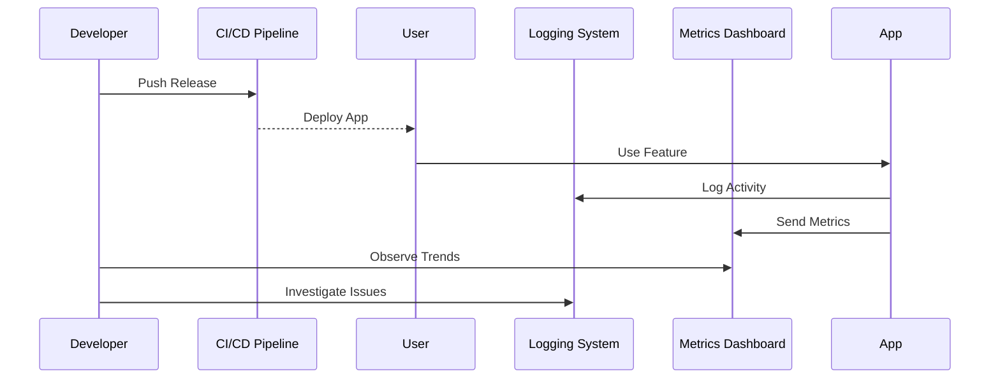

[Back to 目录（Index）](https://github.com/uwspstar/The-Tao-of-Programming-Nature/blob/main/Index.md)

## 📘 Chapter 10: The Final Release is Never Final

## 第十章：发布即是开始

---

### 🌀 1. What Is a "Final Release"?

### 什么是“最终发布”？

> In software, there is no final.
> 在软件世界里，没有“最终”。

> A release is a checkpoint, not a destination.
> 发布是中转站，而非终点。

> Your system enters the world — and the world responds.
> 你的系统走向世界，而世界将给出反馈。

---

### 🧠 2. Why Is Release the Beginning?

### 为什么说“发布是开始”？

> Because only in reality does software meet truth.
> 只有在现实中，软件才遇见真相。

> Users shape the system after launch.
> 用户在使用中塑造系统。

> Bugs emerge. Needs evolve. The Dao flows on.
> Bug 出现，需求进化，道仍在流动。

---

### 🕰️ 3. When Should You Prepare for After-Release?

### 何时应为“发布之后”做好准备？

> Before the release.
> 在发布之前。

> When writing logs, metrics, and recovery paths.
> 在记录日志、埋点指标、设计恢复路径时。

> When asking: “What happens when this fails?”
> 当你自问：“若失败，会如何？”

---

### 🗺️ 4. Where Does the Release Actually Happen?

### “发布”真正发生在哪里？

> Not on the CI server.
> 不在 CI/CD 流水线。

> Not in Git tags.
> 不在 Git 标签。

> It happens in the user's hands.
> 它发生在用户手中。

---

### ⚙️ 5. How to Release with Dao in Mind?

### 如何以“道”的思想来发布？

> 🌱 **Release small. Observe much.**
> 小步发布，多方观察。

> 🧭 **Instrument everything. Assume nothing.**
> 全面监测，不做假设。

> 🔄 **Design for change. Not for completion.**
> 为变化而设计，而非完结。

---

### 💻 C# 示例代码：发布时的可观测性植入

```csharp
public class PaymentService
{
    private readonly ILogger<PaymentService> _logger;
    private readonly IMetricsCollector _metrics;

    public PaymentService(ILogger<PaymentService> logger, IMetricsCollector metrics)
    {
        _logger = logger;
        _metrics = metrics;
    }

    public Result Charge(Card card, decimal amount)
    {
        _metrics.Increment("charge.attempt");
        _logger.LogInformation("Attempting to charge {Amount}", amount);

        try
        {
            // 假设存在调用支付网关
            return Result.Success("Charged");
        }
        catch (Exception ex)
        {
            _logger.LogError(ex, "Charge failed");
            _metrics.Increment("charge.failure");
            return Result.Failure("Error charging");
        }
    }
}
```

> 📊 发布即反馈 —— 可观测性是理解系统的桥梁。
> Release equals feedback — observability bridges the system and the real world.

---

### 🧩 Mermaid 图：发布之后的“道”之旅



> 🔍 发布不是离开，而是开始倾听系统在真实世界中的回响。
> Release is not departure — it is beginning to listen.

---

### 🧙‍♂️ Claude 风格结语格言

> 🛤️ Releasing is like opening the gate —
> The journey begins when the code touches reality.
> 发布如同开门，旅程始于代码走入现实。

> 🧘 Finality is illusion. Software lives, evolves, and flows.
> “最终”是幻觉。软件是有机体，会流动，会生长。
