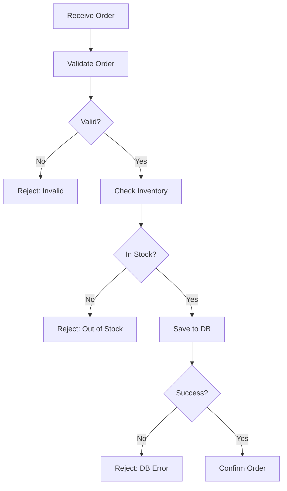

## 📘 Chapter 4: The Flow of Logic

## 第四章：逻辑之流

---

### 🌀 1. What is Logical Flow in Programming?

### 什么是编程中的“逻辑之流”？

> Logic is the riverbed. Code is the water.
> 逻辑是河床，代码是水流。

> A good system flows smoothly from intent to outcome.
> 优秀的系统，逻辑从意图自然流向结果。

> Logic is not just control flow — it is clarity of thought.
> 逻辑不仅是控制流程，更是思维的清晰。

---

### 🧠 2. Why Respect the Flow of Logic?

### 为什么要尊重“逻辑之流”？

> Because when logic is broken, bugs flood in.
> 当逻辑断裂，Bug 泛滥。

> Users feel the dissonance. Developers lose confidence.
> 用户感到困惑，开发者失去信心。

> A clear flow reduces confusion, improves trust.
> 清晰之流，减少误解，增加信任。

---

### 🕰️ 3. When Should You Shape Logic First?

### 何时应优先思考逻辑？

> Before you write code.
> 在动手编码之前。

> When facing complex features or edge cases.
> 面对复杂功能或边界情况时。

> Before meetings — a diagram explains more than words.
> 会议前，一图胜千言。

---

### 🗺️ 4. Where Does Logical Flow Exist?

### “逻辑之流”存于何处？

> In user journeys.
> 在用户旅程中。

> In service orchestration.
> 在服务编排中。

> In every `if`, every `switch`, every `return`.
> 存于每个 if、每个 switch、每个 return 之中。

---

### ⚙️ 5. How to Design Flow Logically?

### 如何设计出良好的逻辑之流？

> 📜 **Sketch first, code later.**
> 先画图，再编码。

> 🧭 **Use diagrams, not paragraphs.**
> 多用图，不多言。

> 🧬 **Keep logic linear unless it must branch.**
> 逻辑尽量线性，必要才分支。

---

### 💻 C# 示例代码：逻辑清晰的订单处理

```csharp
public class OrderProcessor
{
    public Result Process(Order order)
    {
        if (!order.IsValid())
            return Result.Failure("Invalid order");

        if (!order.IsInStock())
            return Result.Failure("Item out of stock");

        var success = SaveOrder(order);
        return success 
            ? Result.Success("Order placed") 
            : Result.Failure("Database error");
    }

    private bool SaveOrder(Order order)
    {
        // 简化后的保存逻辑
        return true;
    }
}
```

> 🧼 清晰流程让维护者无需猜测，每一步都“有道可循”。
> Clear logic frees the mind from guessing — every step has its reason.

---

### 🧩 Mermaid 图：逻辑流程图



> 🌊 逻辑如水流，遇阻才转弯；不断自洽，方可自然运行。
> Logic, like water, bends only when needed — self-consistent and fluid.

---

### 🧙‍♂️ Claude 风格结语格言

> 🧭 The best code paths feel like walking a quiet trail —
> where each turn is expected, and no step surprises.
> 最佳代码路径，如同一条静谧小径——步步合理，无处惊奇。

> 🌌 Logic is not control. It is understanding made manifest.
> 逻辑非控制，而是理解的具象化。
